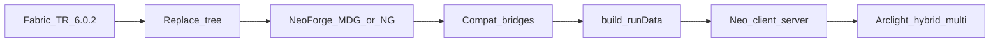

# Fabric → NeoForge 26.1.2 差分移植マニュアル

本書は **本家 Fabric TechReborn `6.0.2`（Minecraft 26.1.2）** を **NeoForge 26.1.2** へ移植するための差分マニュアルである。  
やり直し時は本家ソースでツリーを全置換し、本書の対応表に従って Fabric API を NeoForge / Bridge 層へ置換する。

| 項目 | 内容 |
|------|------|
| 文書 | `docs/FABRIC_TO_NEOFORGE_26.1.2.md` |
| 関連（1.21.1→26.1.2 昇格メモ） | `docs/NEOFORGE_26.1.2_MIGRATION_SPEC.md` |
| 作業ブランチ想定 | `26.1.2` |
| 実装方針 | **ゲームロジックは本家 Fabric を正**、ローダ差分は **compat Bridge** に閉じ込める |

> **注:** 現行フォークの `gradle.properties` が `mod_version=6.0.5` でも、**やり直しのベースラインは本家タグ `6.0.2`** とする。  
> リポジトリ直下 `AGENTS.md` に Java 21 と書いてあっても、**26.1.2 の正は Java 25**（後続で AGENTS を更新する）。

---

## 1. 固定バージョン

| 項目 | 値 |
|------|-----|
| 本家ソース | [TechReborn/TechReborn `6.0.2`](https://github.com/TechReborn/TechReborn/releases/tag/6.0.2)（changelog に `26.1.2`） |
| Minecraft | `26.1.2` |
| Fabric Loader | `0.18.6` |
| Fabric API | `0.145.4+26.1.2` |
| NeoForge | `26.1.2.73`（本フォーク `gradle.properties` の `neo_version` / `neoforge_version`） |
| Loader 範囲（NeoForge） | `[11,)`（`neoforge.mods.toml` / `loader_version_range`） |
| Java | **25** |
| Gradle | **9.1.0+** |
| Energy | `teamreborn:energy` **`5.0.0`**（両ローダで維持。Capability 橋渡し必須） |
| 検証ターゲット | NeoForge `runClient` / `runServer`、Arclight `arclight-neoforge-26.1.2-1.0.2-SNAPSHOT`（Bukkit + NeoForge マルチ） |

本家 `gradle.properties`（タグ `6.0.2`）抜粋:

```properties
mod_version=6.0.2
minecraft_version=26.1.2
loader_version=0.18.6
fapi_version=0.145.4+26.1.2
energy_version=5.0.0
```

---

## 2. 目的と移植フロー

### 2.1 完成目標

1. 本家 Fabric `6.0.2` と同等のゲーム内容が NeoForge で動く。
2. NeoForge クライアント / 専用サーバで起動・プレイ可能。
3. **Arclight NeoForge 26.1.2**（Bukkit + NeoForge）で起動し、マルチサーバ運用可能。

### 2.2 正本フロー



1. 本家 `6.0.2` を取得し、作業ツリーを **全置換**（NeoForge 専用ビルド設定・Bridge は再適用）。
2. Fabric Loom を NeoForge（ModDevGradle / NeoGradle）へ差し替え。
3. `net.fabricmc.*` / Fabric entrypoint を **NeoForge API + Bridge** に置換。
4. `./gradlew build` と datagen を通す。
5. NeoForge client / server で検証。
6. Arclight ハイブリッドで単体 → マルチ検証。

### 2.3 層構造（守るべき境界）

| 層 | 役割 | 例 |
|----|------|-----|
| ゲームロジック | 本家と可能な限り同一 | 機械 BE、レシピ、アイテム定義 |
| Bridge（公開 API 風） | ローダ非依存の薄い窓口 | `TransferApiBridge`, `NetworkingBridge` |
| NeoForge 実装 | Bridge の実体 | `compat/neoforge/NeoForge*Bridge` |
| ローダ配線 | 登録・イベント・mods.toml | `@Mod`, `RegisterEvent`, `RegisterCapabilitiesEvent` |

---

## 3. ツールチェーン差分

| 観点 | Fabric 26.1.2（本家） | NeoForge 26.1.2（本フォーク） |
|------|----------------------|-------------------------------|
| ビルドプラグイン | Fabric Loom（remap なし / Mojmap） | ModDevGradle または NeoGradle 7.1.21+ |
| メタデータ | `fabric.mod.json` | `META-INF/neoforge.mods.toml` |
| エントリ | `ModInitializer` / `ClientModInitializer` | `@Mod` + mod bus / game bus |
| 依存宣言 | `depends` / `suggests` in JSON | `[[dependencies.*]]` in TOML |
| マッピング | Mojang 公式（Yarn 廃止） | 同左（Parchment 任意・削除可） |
| Java | 25 | 25 |
| 難読化 | なし | なし |

### 3.1 メタデータ対応

| Fabric | NeoForge |
|--------|----------|
| `"id": "techreborn"` | `modId = "techreborn"` |
| `"depends": { "fabricloader", "fabric-api", "minecraft" }` | `neoforge` / `minecraft` / `reborncore` の `[[dependencies.*]]` |
| `"entrypoints": { "main", "client", "rei_client", ... }` | `@Mod` コンストラクタ + クライアント専用クラス / JEI・REI の NeoForge 登録 |
| `fabric.mod.json` の `mixins` | `neoforge.mods.toml` の `[[mixins]]` または既存 mixin config |

本フォーク例: [`src/main/resources/META-INF/neoforge.mods.toml`](../src/main/resources/META-INF/neoforge.mods.toml)、[`RebornCore/src/main/resources/META-INF/neoforge.mods.toml`](../RebornCore/src/main/resources/META-INF/neoforge.mods.toml)。

### 3.2 公式根拠

- [NeoForge for Minecraft 26.1](https://neoforged.net/news/26.1release/)
- [NeoForge primer 1.21.11 → 26.1](https://docs.neoforged.net/primer/docs/26.1/)
- [Fabric for Minecraft 26.1](https://fabricmc.net/2026/03/14/261.html)
- [Porting to Fabric API 26.1](https://docs.fabricmc.net/develop/porting/fabric-api)
- [NeoForge mod files](https://docs.neoforged.net/docs/gettingstarted/modfiles/)

---

## 4. Fabric ↔ NeoForge API 対応表

各表の **Bridge** 列は、本フォークで既に存在する「NeoForge 側の正」クラスを指す。やり直し時も **同名 Bridge を再配線**し、ゲームコードから Fabric 型を直接参照しない。

### 4.1 エントリポイント・ライフサイクル

| Fabric 26.1 | NeoForge 26.1 | Bridge / 実装 | 注意 |
|-------------|---------------|---------------|------|
| `ModInitializer#onInitialize` | `@Mod` コンストラクタ + `IEventBus` 購読 | `RebornCore`, `TechReborn` の `@Mod` | 登録は遅延イベントへ |
| `ClientModInitializer` | `@Mod` + `Dist.CLIENT` / client 専用セットアップ | `ClientLifecycleBridge` | サーバクラスパスにクライアント型を載せない |
| Fabric lifecycle events（server start / tick / world load） | `ServerStartingEvent`, `LevelTickEvent`, `LevelEvent.Load` 等 | `ServerLifecycleBridge`, `EventBridge` | Fabric の `World` 名は `Level` に揃っている |
| Client tick / HUD | NeoForge client events / HUD overlay | `ClientLifecycleBridge` | Fabric `HudElementRegistry` 相当を NeoForge 側で再実装 |

### 4.2 レジストリ

| Fabric 26.1 | NeoForge 26.1 | Bridge / 実装 | 注意 |
|-------------|---------------|---------------|------|
| `Registry.register(BuiltInRegistries.*, id, value)` | 同上でも可。推奨は `RegisterEvent` / `DeferredRegister` | `RebornRegistry`, `TRContent`, `ModFluids` 等 | NeoForge では **レジストリフェーズ内**で登録 |
| Fabric registry イベント | `RegisterEvent`（registry key ごと） | 各 `register(RegisterEvent)` | アイテムとブロックの順序に注意 |
| Fuel registry API | NeoForge fuel 登録 | `RegistryBridge` → `NeoForgeFuelRegistryBridge` | |
| Creative tabs | `CreativeModeTab` + イベント | `ItemGroupApiBridge` → `NeoForgeItemGroupBridge` | Fabric 26.1 では `ItemGroupEvents` → `CreativeModeTabEvents` へリネーム済み |
| Flammable blocks | NeoForge flammability | `FlammableBlockApiBridge` → `NeoForgeFlammableBlockBridge` / `FlammableBlockBridge` | |
| Wood / BlockSetType | NeoForge wood type 登録 | `WoodTypeApiBridge` → `NeoForgeWoodTypeBridge` / `WoodTypeBridge` | |
| Villager / trades | NeoForge villager 登録・データパック | `VillagerApiBridge` → `NeoForgeVillagerBridge` / `VillagerBridge` | 26.1 で取引データパック化が進んでいる |
| Entity types | `RegisterEvent` | `EntityTypeBridge` | |

### 4.3 Networking

| Fabric 26.1 | NeoForge 26.1 | Bridge / 実装 | 注意 |
|-------------|---------------|---------------|------|
| `CustomPayload` / `PacketCodec` | `CustomPacketPayload` + `StreamCodec` | 各 `*Payload` record | バニラ型は両ローダで近い |
| `ServerPlayNetworking.registerGlobalReceiver` | `RegisterPayloadHandlersEvent` + `IPayloadHandler` | サーバ側ハンドラ登録 | Fabric 26.1 は C2S/S2C → Serverbound/Clientbound リネーム |
| `ClientPlayNetworking` | 同上（playToClient）+ client handler | `ClientNetworkingBridge` | |
| `ServerPlayNetworking.send` / player targeting | `PacketDistributor.sendToPlayer` 等 | `NetworkingBridge` | tracking は `ChunkPos.containing` を使用（26.1） |
| Configuration channel APIs | NeoForge configuration payload 相当 | 必要なら別途 | TR は主に play チャンネル |

### 4.4 Transfer（アイテム・流体）

Fabric Transfer API は **classpath に残さない**。意味論（トランザクション・Variant）は `reborncore.common.transfer.*`（`RcStorage` 等）に内製し、外向きは NeoForge Capabilities / Transfer に接続する。

| Fabric 26.1 | NeoForge 26.1 | Bridge / 実装 | 注意 |
|-------------|---------------|---------------|------|
| `ItemStorage.SIDED` / `FluidStorage.SIDED` | `Capabilities.Item.BLOCK` / `Capabilities.Fluid.BLOCK` | `TransferApiBridge`, `TechRebornCapabilities` | `RegisterCapabilitiesEvent` で登録 |
| `InventoryStorage` → **`ContainerStorage`**（26.1 rename） | `IItemHandler` / `ResourceHandler<ItemResource>` | `Rc*` wrappers, `LegacyItemHandlerResourceHandler` | |
| `ItemVariant` / `FluidVariant` | `ItemResource` / `FluidResource`（+ 内製 `RcItemVariant` / `RcFluidVariant`） | `TransferApiBridge` | Fabric の `getRegistryEntry` → `typeHolder` 等は本家側の話；Neo では Resource 型を使う |
| `StorageUtil` / `Transaction` | NeoForge transfer + `RcTransaction` | `TransferApiBridge.moveFluids` 等 | |
| `SingleFluidStorage` | tank + `IFluidHandler` / `TankFluidHandler` | `Tank`, `TankFluidHandler` | |
| Item-in-hand fluid（cells） | Item capability / `ItemAccess` | `TransferApiBridge.registerDynamicCellFluidStorage` | `DynamicCellItem` |

### 4.5 Energy

| Fabric 26.1 | NeoForge 26.1 | Bridge / 実装 | 注意 |
|-------------|---------------|---------------|------|
| Team Reborn Energy API（`team.reborn.energy`） | 同ライブラリ + NeoForge Capability 公開 | `EnergyStorageBridge`, `EnergyLookupBridge`, `TeamRebornEnergyCapabilities` | **jar 依存 `5.0.0` は維持** |
| Block energy lookup | Sided block capability | `TechRebornCapabilities.register` | `PowerAcceptorBlockEntity` 等 |
| Item energy | Item capability | `EnergyStorageUtil`, `RcEnergyItemSwingHooks` | |

### 4.6 Screen / Menu

| Fabric 26.1 | NeoForge 26.1 | Bridge / 実装 | 注意 |
|-------------|---------------|---------------|------|
| Extended Screen Handler / extra data codec | NeoForge `MenuType` + extra data | `ScreenHandlerBridge` → `NeoForgeExtendedScreenHandlerBridge` | `GuiType` から呼ぶ |
| `ScreenHandler` sync packets | Payload（例: `ScreenHandlerUpdatePayload`, `SlotSyncPayload`） | `NetworkingBridge` + payloads | |
| Client GUI open | NeoForge menu open API | `ScreenHandlerBridge.openExtended` | |

### 4.7 Worldgen / Biome

| Fabric 26.1 | NeoForge 26.1 | Bridge / 実装 | 注意 |
|-------------|---------------|---------------|------|
| Fabric Biome Modification API | NeoForge Biome Modifiers / datapack | `WorldgenBridge`, `NeoForgeBiomeModifierPack` | JSON データパック優先を検討 |
| Feature / placed feature 登録 | `RegisterEvent` / datapack | TR world パッケージ | |

### 4.8 Client render / input

| Fabric 26.1 | NeoForge 26.1 | Bridge / 実装 | 注意 |
|-------------|---------------|---------------|------|
| Fluid render / `FluidModel`（26.1） | NeoForge fluid client APIs | `FluidVariantRenderingBridge`, `FluidRenderRegistryBridge`, `NeoForgeFluidRenderAppearanceAdapter`, `FluidModelLookupBridge` | Fabric 26.1 は `FluidRenderHandler` から `FluidModel` へ移行 |
| Block render layer map | NeoForge render type / layer | client compat | Fabric rename: `BlockRenderLayerMap` → `ChunkSectionLayerMap` |
| Keybinding helper | NeoForge key mapping | `ClientInputBridge` | Fabric: `KeyBindingHelper` → `KeyMappingHelper` |
| Machine casing models 等 | NeoForge model events | `NeoForgeMachineCasingModelBridge` | |
| Cable render data | クライアント専用 | `RenderDataBridge` | |

### 4.9 Recipe viewers（REI / JEI）

| Fabric 26.1 | NeoForge 26.1 | Bridge / 実装 | 注意 |
|-------------|---------------|---------------|------|
| `fabric.mod.json` entrypoint `rei_client` | REI NeoForge plugin 登録 | `techreborn.client.compat.rei.*` | optional dependency |
| JEI Fabric plugin | `@JeiPlugin` + mods.toml optional | `techreborn.client.compat.jei.*` | 26.1 向け JEI/REI 版を `gradle.properties` で管理 |

### 4.10 ローダユーティリティ

| Fabric 26.1 | NeoForge 26.1 | Bridge / 実装 | 注意 |
|-------------|---------------|---------------|------|
| `FabricLoader.getInstance().getEnvironmentType()` | `FMLEnvironment` / Dist | `LoaderBridge` | |
| `FabricLoader.getGameDir()` | `FMLPaths` | `LoaderBridge.getGameDir()` | |

---

## 5. バニラ 26.1 変更（TechReborn に効くもの）

詳細は [NeoForge primer 26.1](https://docs.neoforged.net/primer/docs/26.1/) を正とする。移植時に特に踏む点だけ列挙する。

| 変更 | 影響 |
|------|------|
| **Java 25** | toolchain / mixin config（`JAVA_25`）/ CI |
| **難読化廃止・Mojmap** | Yarn 名は本家にもう無い。公式名で揃える |
| **`ItemStackTemplate` / `FluidStackTemplate`** | レジストリ未ロード時のスタック表現。レシピ・データ生成で必須になる箇所あり |
| **GUI extract 系リネーム** | `Screen#render*` → `extract*`、`GuiGraphics` 周辺のリネーム。クライアント GUI 全般 |
| **`ChunkPos` API** | `new ChunkPos(BlockPos)` → `ChunkPos.containing`；`asLong` → `pack`；`new ChunkPos(long)` → `unpack`（`NetworkingBridge` 済み） |
| **World → Level 用語** | Fabric API も `*World*` → `*Level*` にリネーム済み。本家 6.0.2 は既に追従している想定 |
| **Fluid / Item Resource とレジストリ** | Capability・Transfer 経路で Resource 型を使う |

Fabric API 側の大規模リネーム一覧は [Porting to Fabric API 26.1](https://docs.fabricmc.net/develop/porting/fabric-api)（IntelliJ migration map あり）。**NeoForge 移植では Fabric 新名を覚える必要は薄い**が、本家差分を読むときの索引になる。

---

## 6. モジュール別置換チェックリスト

やり直し時は「本家ツリーを置いた直後」の状態から、次を上から潰す。

### 6.1 削除・禁止（残してはいけないもの）

- [ ] 本番 jar 用の `fabric.mod.json`（datagen/migration-tool 残骸はビルドから除外）
- [ ] `net.fabricmc.api.*` / `net.fabricmc.fabric.api.*` の import（Bridge 内にも残さない）
- [ ] Fabric Loom 専用設定・`fabric-loom` プラグイン
- [ ] Forgified Fabric API や「Fabric API を NeoForge 上で動かす」依存
- [ ] Fabric Transfer 型（`net.fabricmc.fabric.api.transfer.*`）の直接参照

### 6.2 追加必須（NeoForge）

- [ ] `META-INF/neoforge.mods.toml`（`techreborn` / `reborncore`）
- [ ] `@Mod` エントリと mod event bus 配線
- [ ] `RegisterEvent`（または DeferredRegister）による全レジストリ登録
- [ ] `RegisterPayloadHandlersEvent` による全 Payload 登録
- [ ] `RegisterCapabilitiesEvent`（エネルギー・流体・アイテム）— `TechRebornCapabilities`
- [ ] Java 25 toolchain、Gradle 9.1+、NeoForge `26.1.2.x`

### 6.3 RebornCore

- [ ] Energy: `EnergyStorageBridge` / `EnergyLookupBridge` / Team Reborn Energy 5.0.0
- [ ] Transfer: `TransferApiBridge` + `reborncore.common.transfer.*`
- [ ] Network: `NetworkingBridge` + clientbound/serverbound payloads
- [ ] Screen: `ScreenHandlerBridge` / `NeoForgeExtendedScreenHandlerBridge`
- [ ] Lifecycle: `ServerLifecycleBridge` / `EventBridge` / `LoaderBridge`
- [ ] Fuel / Flammable / Wood / Villager / ItemGroup の `*ApiBridge` → `NeoForge*Bridge`
- [ ] Client: fluid render bridges、`ClientNetworkingBridge`、`ClientInputBridge`、`ClientLifecycleBridge`
- [ ] Multiblock / chunk loader のサーバ tick フックが NeoForge イベントに載っていること

### 6.4 TechReborn（ルートモジュール）

- [ ] Content 登録（`TRContent`, fluids, BE, entities）が `RegisterEvent` 経由
- [ ] `GuiType` → `ScreenHandlerBridge`
- [ ] Packets（`techreborn.packets.*`）とハンドラ登録
- [ ] Machines の Capability 露出（エネルギー・タンク・ストレージユニット）
- [ ] Worldgen: `WorldgenBridge` / `NeoForgeBiomeModifierPack`
- [ ] Client GUI / models / REI / JEI
- [ ] `DynamicCellItem` の流体 capability 登録

### 6.5 既存 Bridge 一覧（再配線の索引）

**RebornCore（共通窓口）**

| クラス | 役割 |
|--------|------|
| `reborncore.common.compat.TransferApiBridge` | アイテム/流体 Transfer |
| `reborncore.common.compat.EnergyStorageBridge` | Energy ストレージ操作 |
| `reborncore.common.compat.EnergyLookupBridge` | Energy lookup |
| `reborncore.common.compat.ItemGroupApiBridge` | Creative tab |
| `reborncore.common.compat.RegistryBridge` | Fuel 等 |
| `reborncore.common.compat.FlammableBlockApiBridge` | 燃焼性 |
| `reborncore.common.compat.WoodTypeApiBridge` | WoodType |
| `reborncore.common.compat.VillagerApiBridge` | 村人 |
| `reborncore.common.network.NetworkingBridge` | 送信ヘルパ |
| `reborncore.common.screen.ScreenHandlerBridge` | Menu / extended open |
| `reborncore.common.event.ServerLifecycleBridge` | サーバライフサイクル |
| `reborncore.common.event.EventBridge` | 汎用イベント |
| `reborncore.common.util.LoaderBridge` | Dist / game dir |
| `reborncore.client.network.ClientNetworkingBridge` | C→S 送信 |
| `reborncore.client.event.ClientLifecycleBridge` | クライアントライフサイクル |
| `reborncore.client.input.ClientInputBridge` | 入力 |
| `reborncore.client.compat.FluidVariantRenderingBridge` | 流体見た目 |
| `reborncore.client.compat.FluidRenderRegistryBridge` | 流体レンダ登録 |

**RebornCore（NeoForge 実体）**

| クラス |
|--------|
| `reborncore.common.compat.neoforge.NeoForgeItemGroupBridge` |
| `reborncore.common.compat.neoforge.NeoForgeFuelRegistryBridge` |
| `reborncore.common.compat.neoforge.NeoForgeFlammableBlockBridge` |
| `reborncore.common.compat.neoforge.NeoForgeWoodTypeBridge` |
| `reborncore.common.compat.neoforge.NeoForgeVillagerBridge` |
| `reborncore.common.compat.neoforge.NeoForgeExtendedScreenHandlerBridge` |
| `reborncore.client.compat.neoforge.NeoForgeFluidRenderAppearanceAdapter` |

**TechReborn**

| クラス | 役割 |
|--------|------|
| `techreborn.init.TechRebornCapabilities` | Capability 一括登録 |
| `techreborn.init.FlammableBlockBridge` | TR 側燃焼性 |
| `techreborn.init.WoodTypeBridge` | ゴムの木等 |
| `techreborn.init.VillagerBridge` | TR 村人 |
| `techreborn.init.EntityTypeBridge` | Nuke 等 |
| `techreborn.world.WorldgenBridge` | Worldgen |
| `techreborn.world.compat.neoforge.NeoForgeBiomeModifierPack` | Biome modifiers |
| `techreborn.client.compat.FluidModelLookupBridge` | 流体モデル |
| `techreborn.client.compat.NeoForgeMachineCasingModelBridge` | ケーシングモデル |
| `techreborn.blocks.cable.RenderDataBridge` | ケーブル描画データ |

---

## 7. 検証手順

### 7.1 ビルド / データ生成

```bash
./gradlew build --stacktrace
./gradlew :RebornCore:runServerData --stacktrace
```

（Windows PowerShell でも同タスク名。NeoGradle 26.1 では旧 `runData` は無効で、`runServerData` / `runClientData` を使う。）

期待: コンパイル成功、`net.fabricmc` 参照ゼロ、生成リソースが NeoForge 実行に載る。

### 7.2 NeoForge 単体

1. `./gradlew :RebornCore:runServer`（またはプロジェクトの `runServer`）— EULA 同意済みであること。
2. `runClient` — タイトル → ワールド作成 → 機械・ケーブル・流体セル・GUI を一通り確認。
3. クライアント ↔ 専用サーバで Payload 同期（スロット、エネルギー表示、マニュアル open 等）。

### 7.3 Arclight（Bukkit + NeoForge）

対象リポジトリ: `C:\Users\SPLIGAN\github\Arclight`（フォーク `SPLIGAN/Arclight`）。

| 項目 | 値 |
|------|-----|
| 実ターゲット MC | **26.1.2**（ブランチ名 `26.1.1_migration` でも中身は 26.1.2） |
| NeoForge | **26.1.2.73**（TechReborn と一致させる） |
| Bukkit / Spigot | `v26_1_R1` / `26.1.2-R0.1-SNAPSHOT` |
| 成果物名の目安 | `arclight-neoforge-26.1.2-1.0.2-SNAPSHOT(+gitHash).jar` |
| 推奨作業ブランチ | 起動まわりの追加修正込みなら `26.1.2_A4rclight`、そうでなければ `26.1.1_migration` |
| TR 専用パッチ | **Arclight 側には無し**（互換は TR の NeoForge 移植のみで担保） |

手順:

1. Java 25 で Arclight をビルド: `./gradlew build collect --stacktrace`（初回は Spigot BuildTools 含むため長い）。
2. 開発スモーク: `./gradlew :bootstrap:runProdNeoforge`（作業ディレクトリは `bootstrap/run_prod/neoforge`、または `ARCLIGHT_PROD_DIR`）。本番相当は `java -jar arclight-neoforge-26.1.2-*.jar nogui`。
3. ビルドした **TechReborn 単一 JAR**（RebornCore Jar-in-Jar 同梱）をサーバ作業ディレクトリの **`mods/`** へ配置。別途 `reborncore.jar` は不要。外部 mod は通常の NeoForge FML 発見。
4. 起動ログで `techreborn` / `reborncore` / `arclight` ロード、Capability・レシピ登録エラーがないこと。
5. Bukkit プラグイン共存下でブロック設置・機械稼働・ドロップが破綻しないこと。

### 7.4 マルチサーバ

同一 Arclight ビルド（同一 NeoForge **26.1.2.73**）を複数インスタンス用意し、少なくとも次を確認する。

| 確認 | 内容 |
|------|------|
| 接続 | 各インスタンスへクライアント接続 |
| コンテンツ | 両サーバで TR アイテム・機械が揃う |
| 同期 | GUI / エネルギー / 流体 / ケーブル接続がクライアントと一致 |
| 横断 | サーバ間移動やマルチ運用で使う構成（プロキシ等）でもクラッシュしない |
| ログ | Fabric API 欠落警告が **出ていない**こと（NeoForge 専用であるべき）。出る場合は Fabric 依存の取り残し |

---

## 8. 参照リンク

### 公式・上流

| 資料 | URL |
|------|-----|
| TechReborn 6.0.2 | https://github.com/TechReborn/TechReborn/releases/tag/6.0.2 |
| TechReborn `26.1` ブランチ | https://github.com/TechReborn/TechReborn/tree/26.1 |
| Fabric 26.1 ブログ | https://fabricmc.net/2026/03/14/261.html |
| Fabric API 26.1 porting | https://docs.fabricmc.net/develop/porting/fabric-api |
| NeoForge 26.1 release | https://neoforged.net/news/26.1release/ |
| NeoForge primer 26.1 | https://docs.neoforged.net/primer/docs/26.1/ |
| NeoForge docs | https://docs.neoforged.net/ |
| NeoForge mod files | https://docs.neoforged.net/docs/gettingstarted/modfiles/ |
| Team Reborn Energy | https://github.com/TechReborn/Energy |

### 本リポジトリ

| 資料 | パス |
|------|------|
| 本マニュアル | `docs/FABRIC_TO_NEOFORGE_26.1.2.md` |
| 26.1.2 昇格仕様（既存） | `docs/NEOFORGE_26.1.2_MIGRATION_SPEC.md` |
| 1.21.1 仕様 | `docs/NEOFORGE_1.21.1_MIGRATION_SPEC.md` |
| バージョン固定 | `gradle.properties` |
| TR mods.toml | `src/main/resources/META-INF/neoforge.mods.toml` |
| RC mods.toml | `RebornCore/src/main/resources/META-INF/neoforge.mods.toml` |

---

## 9. 次フェーズ（本書の外側）

1. 本家 `6.0.2` 取得 → 作業ツリー全置換。  
2. NeoForge ツールチェーンと Bridge 層を本書どおり再適用。  
3. §6 チェックリストと §7 検証を完了。  
4. Arclight マルチ運用を完成目標として締めくくる。

実装に入るときは **本書の対応表を正**とし、ローダ差分をゲームロジックへ漏らさない。

---

## 10. やり直し実施メモ（2026-08-26）

1. 本家タグ `6.0.2` を `upstream` として取得し、`src` / `RebornCore/src` を checkout。
2. Fabric API 参照ファイルは直前の NeoForge 移植 `a64bc347e` をテンプレに再配線。
3. Fabric/NeoForge API 混在でコンパイル不能になったため、**本番 Java は `a64bc347e` の NeoForge 移植ツリーに再統一**（`compileJava` 成功）。
4. Fabric 由来 `compat/jei/recipe/**` は `build.gradle` でコンパイル除外（NeoForge は `TechRebornJeiPlugin` 系統を使用）。
5. `mod_version=6.0.2`。検証は WSL Java 25 で `:RebornCore:compileJava compileJava` = **SUCCESS**。
6. 次: 本家 6.0.2 固有のゲーム差分の cherry-pick、`./gradlew build`、NeoForge client/server、Arclight マルチ。

