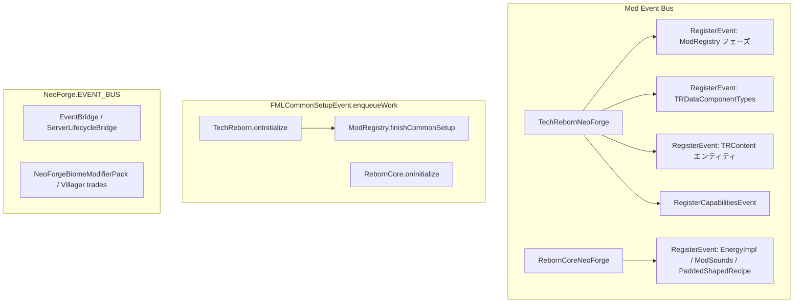

# TechReborn — NeoForge 1.21.1 向け修正仕様書

本書は **Arclight** 上で **NeoForge 対応 TechReborn** を動作させるための修正仕様である。  
実装タスクは本書の ID 順に進め、完了時は各 ID の状態列を更新する。

| 文書の位置 | `docs/NEOFORGE_1.21.1_MIGRATION_SPEC.md` |
| 作業状況（英語） | リポジトリ直下 `NEOFORGE_PORTING.md` |
| 対象ツリー | `RebornCore/` + ルート `TechReborn` + `src/*` のみ（新規トップレベルモジュール追加なし） |

---

## 0. 要約（エグゼクティブ）

| 項目 | 内容 |
|------|------|
| 目的 | Forge/Fabric 1.20 系から **NeoForge 1.21.1** へ移植し、**Arclight NeoForge ハイブリッド鯖**で TechReborn を動かす |
| 最重要 API 変更 | **ItemStack のルート NBT 廃止** → **`DataComponentType` / `DataComponents`** |
| スコープ | **既存ツリーのみ**（`RebornCore` + ルート `TechReborn` + `src/*`）。新規トップレベルモジュール追加なし |
| 配布 | **単一 JAR**（RebornCore を Jar-in-Jar 同梱）。Arclight の `mods/` には TR JAR のみ |
| 現状（2026-05-21 実装更新） | `./gradlew compileJava` / `./gradlew build` **成功**。廃止 ItemStack NBT API / `net.minecraftforge` / `net.fabricmc`（本番 Java）**ソース上ゼロ**。**TR-F01 FluidType 登録完了**、**TR-M01 Mixin JAVA_21 完了**。Arclight 実機検証（TR-A01）は未実施 |
| 未コミット差分 | 移植作業中（`RecipeIngredientCompat.java` 等）— コミットはユーザー判断 |
| 参考実装 | Thermal 系 NeoForge ポート（CoFH `CoFHItemData` / `FluidType` パターン） |

---

## 1. 目的

- **Arclight**（`arclight-neoforge-1.21.1-1.0.2-SNAPSHOT-0769551`）環境で **NeoForge 対応 TechReborn** が安定して動作すること。
- 元の **Fabric / Forge 1.20.1** 系コードから **NeoForge 1.21.1** への API 変更（特に **ItemStack の Data Components 化**、レジストリ登録、ネットワーク）に追随すること。
- 修正は **既存リポジトリのツリー構造内のみ**（新規トップレベルモジュール追加なし）。`RebornCore` + ルート `TechReborn` + 既存 `src/*` 配下で完結させる。
- 修正参考として **Thermal 系 NeoForge ポート**（CoFH / Thermal Core 仕様書）と公式ドキュメントに整合すること。

---

## 2. 前提（ターゲット環境）

| 項目 | 値 |
|------|-----|
| Minecraft | **1.21.1** |
| サーバ（ユーザー指定・優先） | **Arclight `arclight-neoforge-1.21.1-1.0.2-SNAPSHOT-0769551`** |
| サーバ（`gradle.properties` メモ） | `arclight_version=1.0.2-SNAPSHOT-668f9f3` — 実機検証はユーザー指定ビルドを優先 |
| Mod ローダ | **NeoForge 21.1.219** |
| Java | **21** |
| 本リポジトリ mod 版 | **5.11.19**（`gradle.properties`） |
| FML ローダ範囲 | **`[4,)`**（NeoForge 4.x） |

---

## 3. 参照資料

| 資料 | URL / パス |
|------|------------|
| NeoForge 公式 | https://docs.neoforged.net/ |
| Data Components（1.21.1） | https://docs.neoforged.net/docs/1.21.1/items/datacomponents |
| Registries（1.21.1） | https://docs.neoforged.net/docs/1.21.1/concepts/registries |
| Networking / Payloads | https://docs.neoforged.net/docs/1.21.1/networking/payload |
| Capabilities | https://docs.neoforged.net/docs/1.21.1/datastorage/capabilities |
| Fluids / FluidType | https://docs.neoforged.net/docs/1.21.1/resources/server/fluids |
| Forge Wiki（1.20 系の旧 API 把握用） | https://forge.gemwire.uk/wiki/Main_Page |
| Forge / NeoForge 比較表 | https://docs.google.com/spreadsheets/d/1_DQELiPvCF0FmFfyU4opGDbWi7zv-bSl8ImZuh6645E/edit?gid=248444698 |
| 修正参考 — Thermal Core | `C:\Users\SPLIGAN\Documents\GitHub\ThermalCoreForNeoForge\docs\NEOFORGE_1.21.1_MIGRATION_SPEC.md` |
| 修正参考 — Thermal Foundation | `C:\Users\SPLIGAN\Documents\GitHub\ThermalFoundationForNeoForge\docs\NEOFORGE_1.21.1_MIGRATION_SPEC.md` |
| 修正参考 — Thermal Expansion | `C:\Users\SPLIGAN\Documents\GitHub\ThermalExpansionForNeoForge\docs\NEOFORGE_1.21.1_MIGRATION_SPEC.md` |
| 修正参考 — Thermal Dynamics / Integration / Locomotion | 各リポジトリ `docs/NEOFORGE_1.21.1_MIGRATION_SPEC.md` |
| 本リポジトリ作業状況（英語） | `NEOFORGE_PORTING.md` |
| 本リポジトリ（作業対象） | `TechRebornForNeoForge1.21.1` |

---

## 4. スコープ

### 4.1 修正対象ツリー（この枠内のみ）

```
TechRebornForNeoForge1.21.1/
├── build.gradle                 # ルート mod（Jar-in-Jar、datagen/gametest 除外）
├── gradle.properties
├── settings.gradle
├── RebornCore/                  # 共有ライブラリ（NeoGradle userdev）
│   └── src/main/java/reborncore/
│   └── src/client/java/reborncore/
├── src/main/java/techreborn/     # メイン mod ロジック
├── src/client/java/techreborn/  # クライアント
├── src/main/resources/
├── src/client/resources/
├── src/main/generated/          # 既存 datagen 成果物（維持）
├── src/datagen/groovy/          # 未ポート（コンパイル除外）
└── src/gametest/groovy/         # 未ポート（コンパイル除外）
```

**対象外（本仕様では優先度低・ツリー外扱い）**

- `migration-tool/`（Fabric Loom スタブ、本番 JAR 非含有）
- CurseForge / Modrinth 公開パイプラインの細部

### 4.2 モジュール役割

| モジュール | 役割 |
|------------|------|
| **RebornCore** | 共有ライブラリ。NeoGradle userdev、NeoForge 依存、ゲームテスト、Mixin |
| **TechReborn（ルート）** | メイン mod。RebornCore を **Jar-in-Jar** で同梱。NeoGradle は使わず RC の compileClasspath を再利用 |
| **migration-tool** | Fabric Loom スタブ（本番 JAR には含めない） |

### 4.3 配布形態（Arclight）

| 配置 | 内容 |
|------|------|
| `mods/techreborn-*.jar` | TechReborn 単体 JAR（**RebornCore を Jar-in-Jar 同梱**） |
| 別途 `reborncore.jar` | **不要**（同梱のため） |

Thermal 系は `cofh_core` + `thermal` の **二重 JAR** だが、本プロジェクトは **単一 JAR + 埋め込み** が正。

---

## 5. 全体方針（Forge 1.20.1 → NeoForge 1.21.1）

### 5.0 Forge 1.20.1 → NeoForge 1.21.1：変更の本質

Minecraft **1.20.5+** でバニラが導入した **Data Components** が、Forge 1.20.1 時代の「アイテム＝ルート `CompoundTag`」モデルを置き換える。NeoForge 1.21.1 はこのバニラモデルに完全追随する。

| レイヤ | Forge 1.20.1 の慣行 | NeoForge 1.21.1 |
|--------|---------------------|-----------------|
| アイテム永続（インベントリ・ドロップ） | `ItemStack` の NBT タグ全体 | **`DataComponentMap`**（バニラ + mod 登録の `DataComponentType`） |
| ブロック設置時の BE 復元 | NBT を手で `BlockEntity` に書き込み | **`DataComponents.BLOCK_ENTITY_DATA`**（`CustomData`） |
| ブロックエンティティ（ワールド上） | `saveAdditional(CompoundTag)` | **変更なし** — ワールド上の BE は従来どおり NBT |
| チャンク・エンティティ | `CompoundTag` | **変更なし** |
| レシピ ingredient（JSON） | アイテム ID + NBT 相当 | コンポーネント付き `ItemStack` または `Ingredient` codec |
| ネットワーク（アイテム） | NBT 共有タグ | 各コンポーネントの **`networkSynchronized` codec** |
| Mod ローダ API | `net.minecraftforge.*` | `net.neoforged.neoforge.*` / `net.neoforged.fml.*` |

**Thermal（CoFH）との対応関係**

- CoFH: 単一ラッパー **`CoFHItemData`** + `CoFHDataComponents.COFH_ITEM_DATA`（内部はサブ NBT を保持しつつ ItemStack ルート NBT は使わない）
- TechReborn: **複数の `DataComponentType`**（`TRDataComponentTypes`）+ バニラ `DataComponents` + TeamReborn Energy コンポーネント

### 5.1 ItemStack と NBT の切り分け（最重要）

Minecraft 1.21 以降、アイテムの「タグ NBT」は廃止方向。**`ItemStack` は `DataComponentMap` を持つ**（NeoForge 公式: [Data Components](https://docs.neoforged.net/docs/1.21.1/items/datacomponents)）。

| 用途 | 1.20.1（Forge/Fabric 慣行） | 1.21.1（NeoForge）方針 |
|------|---------------------------|------------------------|
| アイテム独自データ | `ItemStack#getTag()` / `setTag()` | **`DataComponentType`** — `stack.get` / `stack.set` / `stack.update` |
| ブロック設置時の BE データ | NBT 手動コピー | **`DataComponents.BLOCK_ENTITY_DATA`** + `CustomData` |
| バニラ相当（エンチャント等） | NBT | **`DataComponents.ENCHANTMENTS`** 等 |
| ブロックエンティティ永続化（ワールド） | `CompoundTag` in `saveAdditional` | **引き続き `CompoundTag`**（変更なし） |
| スロット設定・マルチブロック等（BE 内部） | `CompoundTag` | **引き続き `CompoundTag`**（`SlotConfiguration`, `FluidConfiguration` 等） |
| レシピ JSON の Fabric 形式 | `fabric:components` | **`RecipeIngredientCompat`** でデコード（既存レシピ資産維持） |
| ネットワーク上のアイテム | NBT 読み書き | **`ItemStack.STREAM_CODEC`** / コンポーネント付き codec |

**禁止（本 mod の `*.java` ソース）**

| 廃止 API | 置換 |
|----------|------|
| `stack.getTag()` | `stack.get(DataComponentType)` または専用ヘルパ |
| `stack.setTag(CompoundTag)` | `stack.set(DataComponentType, value)` |
| `stack.hasTag()` | `stack.has(DataComponentType)` |
| `stack.getOrCreateTag()` | `stack.update(type, default, UnaryOperator)` |
| `stack.getShareTag()` / `writeShareTag()` | コンポーネントの `networkSynchronized` codec |

→ **2026-05-21 調査: 上記は Java ソースに該当なし**（grep ゼロ）。新規コードでも使用しない。

**本リポジトリの参照実装**

```58:74:RebornCore/src/main/java/reborncore/common/BaseBlockEntityProvider.java
		ItemStack newStack = stack.copy();
		newStack.applyComponents(blockEntity.collectComponents());
		CompoundTag blockEntityData = blockEntity.saveWithId(world.registryAccess());
		newStack.set(DataComponents.BLOCK_ENTITY_DATA, CustomData.of(blockEntityData));
		// ...
		CustomData nbtComponent = itemStack.get(DataComponents.BLOCK_ENTITY_DATA);
		if (nbtComponent != null) {
			nbtComponent.loadInto(world.getBlockEntity(pos), world.registryAccess());
		}
```

```64:70:src/main/java/techreborn/component/TRDataComponentTypes.java
	public static void register(RegisterEvent event) {
		event.register(Registries.DATA_COMPONENT_TYPE, ResourceLocation.fromNamespaceAndPath(TechReborn.MOD_ID, "is_active"), () -> IS_ACTIVE);
		// aoe5, frequency_transmitter, painting_cover, fluid ...
	}
```

**Forge 1.20.1 コードからの置換パターン（実装時チェックリスト）**

| 旧（Forge/Fabric） | 新（NeoForge 1.21.1） |
|--------------------|----------------------|
| `stack.getTag()` → キー読み取り | `stack.get(MY_TYPE)` または `stack.get(DataComponents.CUSTOM_DATA)`（レガシー移行のみ） |
| `stack.setTag(tag)` | キーごとに `stack.set(type, value)` |
| `stack.getOrCreateTag().putBoolean("active", true)` | `stack.set(TRDataComponentTypes.IS_ACTIVE, true)` |
| `stack.hasTag()` | `stack.has(MY_TYPE)` |
| BE 破壊ドロップで NBT 手コピー | `getDropWithContents` → `applyComponents` + `BLOCK_ENTITY_DATA` |
| エネルギーアイテム NBT | `team_reborn_energy:energy`（`EnergyImpl`） |
| 動的セル流体 | `techreborn:fluid`（`Holder<Fluid>`） |
| `Ingredient.fromJson` が NBT 付きを解釈しない | `RecipeIngredientCompat.CODEC`（`fabric:components` フォールバック） |

**Thermal（CoFH）との対応**

| Thermal / CoFH | TechReborn 相当 |
|----------------|-----------------|
| `CoFHItemData` + `CoFHDataComponents.COFH_ITEM_DATA` | `TRDataComponentTypes` + 各 Item クラス |
| `DataComponents.BLOCK_ENTITY_DATA` on cells | `BaseBlockEntityProvider`, `TankUnitBaseBlockEntity` |
| `DataComponents.CUSTOM_DATA` は読み取りのみ・書き込み時削除 | 新規では使わない（レガシー移行時のみ検討） |

### 5.2 レジストリ

| 項目 | Forge 1.20.1 | 本プロジェクト方針 |
|------|--------------|-------------------|
| 登録 API | `DeferredRegister` が一般的 | **`RegisterEvent` フェーズ分割** + `RebornRegistry.registerIdent` / `registerBlockOnly` / `registerBlockItem` |
| 即時 `Registry.register` | 起動時一括 | **`RegisterEvent` リスナー内のみ**（凍結後登録を防止） |
| ResourceLocation | `new ResourceLocation(ns, path)` | **`ResourceLocation.fromNamespaceAndPath` / `parse`** |
| データコンポーネント | なし | `RegisterEvent` + `Registries.DATA_COMPONENT_TYPE` |

Thermal は `DeferredRegister` を採用するが、本リポジトリは **既存の RegisterEvent パターンを維持**（大規模リファクタを避ける）。

**作業ツリーでのフェーズ順（`ModRegistry.registerNeoForge`）**

1. `FLUID` — `ModFluids.registerFluidsOnly`
2. `BLOCK` — 通常ブロック + `ModFluids.registerFluidBlockOnly`
3. `ITEM` — BlockItem + `ModFluids.registerFluidBucketOnly` + 単体アイテム
4. `SOUND_EVENT`
5. `POINT_OF_INTEREST_TYPE` / `VILLAGER_PROFESSION`
6. `CREATIVE_MODE_TAB`
7. `RECIPE_TYPE` / `RECIPE_SERIALIZER` — `ModRecipes.register`
8. `BLOCK_ENTITY_TYPE` — `TRBlockEntities.register`

### 5.3 イベント

| 項目 | Forge 1.20.1 | NeoForge 1.21.1 |
|------|--------------|-----------------|
| 購読 | `@Mod.EventBusSubscriber` | **使用しない** — `@Mod` コンストラクタで `modBus.addListener` / `NeoForge.EVENT_BUS.addListener` |
| Mod バス | `FMLJavaModLoadingContext.get().getModEventBus()` | **`IEventBus modBus` 注入** |
| ゲームバス | `MinecraftForge.EVENT_BUS` | **`NeoForge.EVENT_BUS`** |
| スポーン配置 | `SpawnPlacementRegisterEvent` | `RegisterSpawnPlacementsEvent` |
| アイテム拾い | `EntityItemPickupEvent` | `ItemEntityPickupEvent.Pre` + `TriState` |
| ブロック使用 | `use` 系 | `useItemOn` → `ItemInteractionResult` |
| 燃料 | Forge 燃料レジストリ | `FurnaceFuelBurnTimeEvent`（`NeoForgeFuelRegistryBridge`） |
| クリエイティブタブ | Forge イベント | `BuildCreativeModeTabContentsEvent` |
| 村人放浪商人 | Forge 取引イベント | `WandererTradesEvent` |

### 5.4 ネットワーク

| 項目 | Forge 1.20.1 | NeoForge 1.21.1 |
|------|--------------|-----------------|
| チャネル | `SimpleChannel` | **`RegisterPayloadHandlersEvent`** + `CustomPacketPayload` |
| シリアライズ | `FriendlyByteBuf` 手書き | **`StreamCodec`**（`BlockPos.STREAM_CODEC`, `ItemStack.STREAM_CODEC` 等） |
| 登録 | `NetworkRegistry` | `event.registrar("1")` — `TechRebornNeoForge`, `RebornCoreNeoForge` |

### 5.5 流体

| 項目 | Fabric / Forge 1.20.1 | NeoForge 1.21.1 |
|------|----------------------|-----------------|
| 転送抽象 | Fabric Transfer API `FluidVariant` | 内部 **`RcFluidVariant`** + NeoForge **`IFluidHandler` / `FluidStack`** |
| クライアント描画 | Fabric 流体レンダリング | **`IClientFluidTypeExtensions`**（`NeoForgeFluidRenderAppearanceAdapter`） |
| レジストリ | `Fluid` のみ | **`Fluid` + `FluidType`**（`NeoForgeRegistries.Keys.FLUID_TYPES`）— **未実施 TR-F01** |
| BE / Tank 永続化 | NBT + 独自単位 | **`FluidInstance` + `FluidValue`**（レシピ JSON は legacy mB 対応） |
| NBT 読み込み | `FluidStack.loadFluidStackFromNBT` | **`FluidStack.parseOptional(RegistryAccess, CompoundTag)`** |
| 量変更 | `copy()` + `setAmount` | **`copyWithAmount(n)`** |
| ネットワーク | `readFluidStack()` | **`FluidStack.STREAM_CODEC`** |

→ **2026-05-21**: `loadFluidStackFromNBT` / `readFluidStack` は **grep ゼロ**。

### 5.6 能力（Capabilities）

| Forge 1.20.1 | NeoForge 1.21.1 |
|--------------|-----------------|
| `LazyOptional<T>` + `ICapabilityProvider` | **`stack.getCapability(Capabilities.*)`** — null チェック |
| `AttachCapabilitiesEvent` | **`RegisterCapabilitiesEvent`** |
| `CapabilityManager` | `Capabilities.ItemHandler` / `FluidHandler` / `EnergyStorage` |

**Data Attachments への移行は不要**（Thermal も Capabilities 維持）。

本リポジトリ: `TechRebornCapabilities.register` — エネルギー・流体・インベントリ BE。

### 5.7 RegistryAccess（Arclight 向け）

データパック同期後の lookup が必要な処理（動的レシピ一覧、タグ依存の燃料変換など）は、  
**`TagsUpdatedEvent#getRegistryAccess()`** を優先。起動直後やリロード直後の `BuiltInRegistries` 全件列挙は Arclight で空になることがある（Thermal **TC-N13b** と同種）。

**Arclight 向けコード上の注意**

- サーバ専用コードでクライアントクラス（`@OnlyIn(Dist.CLIENT)` 相当）を参照しない。
- Bukkit + NeoForge 混在クラスパス — `Registry is already frozen` は登録タイミングバグの典型。
- Arclight 専用 API（`arclight` パッケージ）への依存は **不要・禁止**。

---

## 6. アーキテクチャ（現状）

### 6.1 二重エントリポイント



- **ゲームロジック**は従来どおり `TechReborn.onInitialize()` / `RebornCore.onInitialize()`。
- **レジストリ**は `TechRebornNeoForge` / `RebornCoreNeoForge` の `RegisterEvent` リスナー。
- **Forgified Fabric API はランタイム依存から除去済み**（`NEOFORGE_PORTING.md` 参照）。

### 6.2 ブリッジ層（ローダー非依存化）

| ブリッジ | NeoForge 実装 | 用途 |
|----------|---------------|------|
| `LoaderBridge` | FML `FMLEnvironment` / `ModList` | 環境判定 |
| `NetworkingBridge` | `RegisterPayloadHandlersEvent` | パケット |
| `EventBridge` | `NeoForge.EVENT_BUS` | コマンド・ルート・ブロック使用 |
| `ServerLifecycleBridge` | サーバ tick / ロード | ワールドイベント |
| `ClientLifecycleBridge` | クライアント lifecycle | リソース・レンダ |
| `TransferApiBridge` | `Capabilities.*` | 流体・アイテム搬送 |
| `EnergyLookupBridge` / `EnergyStorageBridge` | TeamReborn Energy Cap | EU |
| `VillagerApiBridge` | `NeoForgeVillagerBridge` | 村人 |
| `ItemGroupApiBridge` | `NeoForgeItemGroupBridge` | クリエイティブタブ |
| `FluidRenderRegistryBridge` | `NeoForgeFluidRenderAppearanceAdapter` | 流体描画 |
| `ScreenHandlerBridge` | `NeoForgeExtendedScreenHandlerBridge` | 拡張 GUI |
| `RegistryBridge` | `NeoForgeFuelRegistryBridge` | かまど燃料 |
| `WorldgenBridge` | `NeoForgeBiomeModifierPack` | バイオーム修飾 |

### 6.3 Jar-in-Jar

- ルート `jar` が `RebornCore` を `META-INF/jarjar/reborncore.jar` に同梱。
- `prepareNeoForgeSmokeMods` → `build/smoke-neoforge/mods`（Arclight 検証用）。

---

## 7. Forge / NeoForge API 対応表（主要）

比較表・[Forge Wiki](https://forge.gemwire.uk/wiki/Main_Page)・[NeoForge Docs](https://docs.neoforged.net/) に基づく。実装時は [比較スプレッドシート](https://docs.google.com/spreadsheets/d/1_DQELiPvCF0FmFfyU4opGDbWi7zv-bSl8ImZuh6645E/edit?gid=248444698) の該当行を再確認すること。

### 7.1 ローダー・イベント・レジストリ

| 区分 | Forge 1.20.1（廃止・非推奨） | NeoForge 1.21.1（置換） | 本リポジトリ状態 |
|------|------------------------------|-------------------------|------------------|
| パッケージ | `net.minecraftforge.*` | `net.neoforged.neoforge.*` / `net.neoforged.fml.*` | **import ゼロ** |
| Mod エントリ | `@Mod` + `FMLJavaModLoadingContext.get().getModEventBus()` | `@Mod` + コンストラクタ `IEventBus modBus` | **完了** |
| イベント購読 | `@Mod.EventBusSubscriber` | `modBus.addListener` / `NeoForge.EVENT_BUS.addListener` | **未使用** |
| レジストリ | `DeferredRegister.create(...)` | `RegisterEvent` または DR | **RegisterEvent フェーズ** |
| `ResourceLocation` | `new ResourceLocation(ns, path)` | `fromNamespaceAndPath` / `parse` | **置換済み** |
| スポーン | `SpawnPlacementRegisterEvent` | `RegisterSpawnPlacementsEvent` | 該当エンティティのみ |
| 燃料 | Forge `FuelRegistry` | `FurnaceFuelBurnTimeEvent` | **NeoForgeFuelRegistryBridge** |
| クリエイティブタブ | `CreativeModeTab.builder` + `tab()` | `BuildCreativeModeTabContentsEvent` | **完了** |
| バイオーム | Forge `BiomeModifier` JSON | NeoForge `BiomeModifier` + `AddPackFindersEvent` | **NeoForgeBiomeModifierPack** |
| データ生成 | `GatherDataEvent` | 同名（NeoForge バス） | **未実施 TR-D01** |

### 7.2 アイテム・データ・ネットワーク

| 区分 | Forge 1.20.1 | NeoForge 1.21.1 | 本リポジトリ状態 |
|------|--------------|-----------------|------------------|
| Item ルート NBT | `getTag` / `setTag` / `hasTag` / `getOrCreateTag` | **禁止** — Data Components | **grep ゼロ** |
| BE → ドロップ | NBT 手動 | `collectComponents` + `BLOCK_ENTITY_DATA` | **BaseBlockEntityProvider** |
| エネルギー Item | Cap または NBT | `team_reborn_energy:energy` | **EnergyImpl** |
| ネットワーク | `SimpleChannel` + `FriendlyByteBuf` | `RegisterPayloadHandlersEvent` + `StreamCodec` | **完了** |
| Ingredient 同期 | 旧 API | `Ingredient.CONTENTS_STREAM_CODEC` | **SizedIngredient** |
| Fabric レシピ JSON | `fabric:components` ingredient | `RecipeIngredientCompat` フォールバック | **新規（未追跡）**；現行 `src/main/resources` / `generated` に `fabric:` **なし** |
| レシピ Serializer | `RecipeSerializer` のみ | `codec()` + `streamCodec()` 必須 | **RecipeManager** |
| ScreenHandler 拡張 | Fabric Extended | `IMenuTypeExtension` + `StreamCodec` | **NeoForgeExtendedScreenHandlerBridge** |

### 7.3 流体・能力・その他

| 区分 | Forge 1.20.1 | NeoForge 1.21.1 | 本リポジトリ状態 |
|------|--------------|-----------------|------------------|
| 流体転送 | `FluidUtil` / LazyOptional | `Capabilities.FluidHandler` + `FluidStack` | **TransferApiBridge** |
| 流体 NBT | `FluidStack.loadFluidStackFromNBT` | `FluidStack.parseOptional(RegistryAccess, tag)` | **grep ゼロ** |
| 流体量変更 | `copy()` + `setAmount` | `copyWithAmount(n)` | 使用箇所は置換済み想定 |
| 流体レジストリ | `Fluid` のみ | **`Fluid` + `FluidType`** | **TR-F01 完了**（`RebornFluidTypes` + `ModRegistry` FLUID_TYPES フェーズ） |
| クライアント流体 | Forge 流体属性イベント | `IClientFluidTypeExtensions`（**FluidType 必須**） | **NeoForgeFluidRenderAppearanceAdapter** |
| Capabilities | `AttachCapabilitiesEvent` | `RegisterCapabilitiesEvent` | **TechRebornCapabilities** |
| FFAPI Transfer | `FluidVariant` / Fabric API | **不使用** — 内部 `RcFluidVariant` + NeoForge Cap | **除去済み** |
| Mixin | `JAVA_17` | **`JAVA_21`** | **TR-M01 完了**（`reborncore.common` / `reborncore.client` mixin json） |
| 村人取引 | Forge イベント | `WandererTradesEvent` 等 | **完了** |
| 村構造 | Registry フック | データパック template pool | **TR-V01 未実施** |

---

## 8. 修正仕様 — ビルド・メタデータ

| ID | 内容 | 受入条件 | 状態 |
|----|------|----------|------|
| B-01 | `gradle.properties` — MC **1.21.1** / NeoForge **21.1.219** / Java **21** | 依存解決 | **完了** |
| B-02 | RebornCore: NeoGradle userdev **7.1.25** | `./gradlew` 設定成功 | **完了** |
| B-03 | ルート: RC compileClasspath 再利用（二重 userdev なし） | `compileJava` 成功 | **完了** |
| B-04 | `META-INF/neoforge.mods.toml`（TR / RC） | `neoforge [21.1.216,)`, `minecraft [1.21.1,1.21.2)` | **完了** |
| B-05 | Jar-in-Jar メタデータ `generateJarJarMetadata` | TR JAR 内に RC 同梱 | **完了** |
| B-06 | `./gradlew compileJava` | エラーなし | **完了**（2026-05-21 再検証） |
| B-07 | `./gradlew build` / `:RebornCore:runServer` / gameTestServer | 成果物・専用鯖起動 | **build 完了**（2026-05-21）、runServer / gameTest は要検証 |
| B-08 | Fabric datagen / gametest Groovy | コンパイル除外のまま | **意図的スキップ** — §9 TR-D01 |
| B-09 | `neoforge_version` と `neo_version` の整合 | 同一 **21.1.219** | **完了** |
| B-10 | 未追跡 `RecipeIngredientCompat.java` をリポジトリに含める | ビルド・レビュー可能 | **未コミット** |

**`build.gradle` ルートの主な変更（作業ツリー）**

- `sourceSets.datagen` / `gametest` の Groovy を空にしコンパイル除外
- `main` に `src/client/java` を統合、`PalQuantumSuitFlightHandler` を compile 除外
- Jar-in-Jar: `generateJarJarMetadata` + RC JAR 埋め込み
- `prepareNeoForgeSmokeMods` タスク追加
- `evaluationDependsOn(':RebornCore')` + IDEA/Eclipse classpath 連携

---

## 9. 修正仕様 — ソース（実装順・バックログ）

**上から順に**実施。完了時は状態を **完了** に更新する。

### 9.1 完了済み（作業ツリー / 調査で確認）

| ID | 内容 | 主要ファイル |
|----|------|--------------|
| TR-R01 | `RegisterEvent` フェーズ登録（流体→ブロック→アイテム→…） | `ModRegistry.java`, `ModFluids.java`, `ModRecipes.java`, `TRBlockEntities.java` |
| TR-R02 | `RebornRegistry.registerBlockOnly` / `registerBlockItem` | `RebornRegistry.java` |
| TR-R03 | `TRDataComponentTypes` 登録 | `TRDataComponentTypes.java`, `TechRebornNeoForge.java` |
| TR-R04 | `EnergyImpl` — `team_reborn_energy:energy` を `RegisterEvent` で登録 | `EnergyImpl.java`, `RebornCoreNeoForge.java` |
| TR-R05 | `RecipeIngredientCompat` — `fabric:components` レシピ互換 | `RecipeIngredientCompat.java`, `SizedIngredient.java` |
| TR-R06 | 流体レシピ JSON — `FluidValue.RECIPE_AMOUNT_CODEC` / `FluidInstance` | `FluidValue.java`, `FluidInstance.java` |
| TR-R07 | 村人 POI / Profession — `RegisterEvent` | `TRVillager.java`, `NeoForgeVillagerBridge.java` |
| TR-R08 | Payload ネットワーク | `TechRebornNeoForge.java`, `Packets.java` |
| TR-R09 | Capabilities 登録 | `TechRebornCapabilities.java` |
| TR-R10 | BE ドロップ — `DataComponents.BLOCK_ENTITY_DATA` | `BaseBlockEntityProvider.java` |
| TR-R11 | バイオーム修飾ランタイムパック | `NeoForgeBiomeModifierPack.java` |
| TR-R12 | `net.minecraftforge` / `ForgeRegistries` / `@Mod.EventBusSubscriber` 除去 | grep **該当なし** |
| TR-R13 | Forgified Fabric API 除去・Capabilities 搬送 | `TransferApiBridge`, `NEOFORGE_PORTING.md` |
| TR-R14 | 機械筐体モデル `ModelEvent.ModifyBakingResult` | `NeoForgeMachineCasingModelBridge` |
| TR-R15 | エネルギーツール Mixin（採掘リセット防止） | `MixinItemRcEnergy*` |
| TR-R16 | `ModRecipes` / `TRBlockEntities` — RegisterEvent 向け prepare + 遅延登録 | `ModRecipes.java`, `TRBlockEntities.java` |
| TR-F01 | **FluidType 登録** | `RebornFluidTypes` + `ModFluids.registerFluidTypeOnly` + `ModRegistry` FLUID_TYPES フェーズ；`RebornFluid#getFluidType()` | `RebornFluidTypes.java`, `RebornFluid.java`, `ModFluids.java`, `ModRegistry.java` |
| TR-M01 | **Mixin `compatibilityLevel`** | `reborncore.common.mixins.json` / `reborncore.client.mixins.json` → **JAVA_21** | **完了** |

### 9.2 未完了・要実装

| ID | 内容 | 仕様 | 優先度 | 状態 |
|----|------|------|--------|------|
| TR-V01 | **村人の家（構造プール）** | Fabric の `DynamicRegistrySetupCallback` 相当をデータパック（template pool merge）で再実装。現状 `TRVillager.registerVillagerHouses` はログのみ | 中 | **未実施** |
| TR-D01 | **Datagen ポート** | `src/datagen/groovy`（52 ファイル）→ NeoForge `GatherDataEvent` / Java。Groovy 除外を解除できるまで `src/main/generated` 維持 | 中 | **未実施** |
| TR-G01 | **GameTest ポート** | `src/gametest`（7 ファイル）→ NeoForge GameTest | 低 | **未実施** |
| TR-P01 | **PAL（Player Ability Lib）** | `PalQuantumSuitFlightHandler` — compile 除外解除 + NeoForge 有効化 | 中 | **未実施** |
| TR-N01 | **`RcFabricEnergyItem` リネーム** | 動作は NeoForge mixin。名前のみ Fabric 由来 | 低 | **未実施** |
| TR-N02 | **`gradle.properties` Fabric プロパティ整理** | `yarn_version`, `loader_version`, `fapi_version` — migration-tool 専用にコメント | 低 | **未実施** |
| TR-N03 | **`settings.gradle` Fabric Loom リポジトリ** | migration-tool のみ必要なら条件付き | 低 | **未実施** |
| TR-N04 | **動的レシピ / タグ依存初期化** | `TagsUpdatedEvent` + `RegistryAccess` 注入（§付録 D の高リスク箇所を優先） | 中 | **要調査** |
| TR-N06 | **`Registry.register(BuiltInRegistries.*)` の登録タイミング** | `RebornRegistry` / `ModFluids` / `InitUtils` / `TRItemGroup` / `WorldGenerator` — `RegisterEvent` 内呼び出しに限定されているか再監査（凍結例外防止） | 中 | **要監査** |
| TR-N05 | **`mods.toml` modId 統一** | ソース `modId=techreborn` vs `build.gradle` expand `techreborn-neoforge` — 意図を文書化し一本化 | 低 | **要確認** |
| TR-B01 | **`./gradlew build` / runServer** | B-06 以外の Gradle タスク成功 | 高 | **build 完了**、runServer 要検証 |
| TR-B02 | **未コミット差分のコミット** | `RecipeIngredientCompat.java` 等 | 高 | **ユーザー判断** |
| TR-A01 | **Arclight 実機検証** | §12 の A-01〜A-06 | 高 | **未実施** |

### 9.3 TR-F01 実装記録（FluidType）— 完了

**採用方針（短期）**

- 既存 `RebornFluid`（`FlowingFluid`）を維持し、`getFluidType()` をオーバーライド。
- `RebornFluidTypes.create(FluidSettings)` が `FluidType` + `initializeClient`（still/flow テクスチャ）を生成。
- `ModRegistry.registerNeoForge`: `FLUID_TYPES` → `FLUID` → `BLOCK` → `ITEM` の順で `RegisterEvent` 登録。

**主要ファイル**

| ファイル | 役割 |
|----------|------|
| `RebornCore/.../RebornFluidTypes.java` | FluidType ファクトリ（Thermal `SapFluid` 相当のクライアント拡張） |
| `RebornCore/.../RebornFluid.java` | `getFluidType()` / バケット音を FluidType から取得 |
| `src/.../ModFluids.java` | 流体ごとに `fluidType` を保持し `registerFluidTypeOnly` |
| `src/.../ModRegistry.java` | `NeoForgeRegistries.Keys.FLUID_TYPES` フェーズ |

**未着手（長期・任意）**

- `RebornFluid` → `BaseFlowingFluid` への全面移行（Thermal 完全同等）。
- 流体ごとの density / viscosity 個別チューニング。

**受入（実機）**

- バケット色・タンク内流体表示・ワールド流体ブロックのテクスチャが TR アセットパスになること（Arclight / dev クライアントで確認）。

### 9.4 TR-V01 実装メモ（村の家）

- 1.21 では `StructureTemplatePool#templates` が private のため、Fabric 時代のレジストリフックは不可（`TRVillager` コメント参照）。
- **推奨**: データパックで `village/*/houses` pool に TR 構造を merge。
- `EventBridge.onTemplatePoolAdded` は no-op — datapack 登録に置換または削除。

### 9.5 TR-R05 / レシピ資産

既存 JSON に `fabric:components` が残る場合:

```json
"fabric:type": "fabric:components"
```

→ **`RecipeIngredientCompat.CODEC`** が `Ingredient.CODEC_NONEMPTY` 失敗後にフォールバックデコード。  
対応コンポーネント（現状）: `techreborn:fluid` → `TRDataComponentTypes.FLUID`。  
新規 datagen は **NeoForge 形式**（通常の `item` + component または `SizedIngredient` codec）を優先。

### 9.6 CompoundTag が残る正当な箇所（変更不要）

以下は **Data Components 化の対象外**（BE・チャンク・設定の永続化）:

| 領域 | 代表クラス |
|------|------------|
| スロット設定 | `SlotConfiguration`, `SlotConfigSavePayload` |
| 流体設定 | `FluidConfiguration`, `FluidConfigSavePayload` |
| マルチブロック | `MultiblockControllerBase` |
| 機械 BE | `MachineBaseBlockEntity`, `StorageUnitBaseBlockEntity`, 各 Generator |
| IDSU / LESU | `IDSUManager`, `InterdimensionalSUBlockEntity` |
| ネットワークペイロード | 各 `*Payload` の `CompoundTag` フィールド |
| レシピビルダー | `PaddedShapedRecipeJsonBuilder` |

**変換ルール**: `CompoundTag` on **BlockEntity** / **Level** save は維持。`CompoundTag` on **ItemStack**（ルートタグ）のみ禁止。

---

## 10. 修正仕様 — モジュール別詳細

### 10.1 RebornCore

| 領域 | 現状 | 追加作業 |
|------|------|----------|
| 登録 | `RebornCoreNeoForge` — Energy, Sounds, PaddedShapedRecipe | — |
| エネルギー | `EnergyImpl` Data Component | — |
| 転送 | `TransferApiBridge`, `TankFluidHandler`, `RcFluidVariant` | FluidType（TR 側と連携） |
| レシピ | `RecipeManager.createRecipeRegistration` — MapCodec + StreamCodec | 全レシピ型の網羅テスト |
| ネットワーク | `RegisterPayloadHandlersEvent` | — |
| Mixin | `MixinItemRcEnergy*` | JAVA_21（TR-M01） |
| 村人 | `NeoForgeVillagerBridge` — POI 作成と RegisterEvent 登録分離 | — |
| アイテムユーティリティ | `InventoryItem`, `ItemUtils`, `ItemStackSerializer` | Data Components 利用の実機確認 |

### 10.2 TechReborn

| 領域 | 現状 | 追加作業 |
|------|------|----------|
| 登録 | `ModRegistry` フェーズ | TR-F01 |
| コンポーネント | `TRDataComponentTypes` | Dynamic Cell 等の利用箇所の実機確認 |
| 村人 | POI/Profession/取引 | TR-V01 |
| ワールド生成 | `NeoForgeBiomeModifierPack` | Arclight で鉱石・ルビー木確認 |
| 互換 | JEI/REI compileOnly | サーバ JAR に含めない |
| PAL | 除外コンパイル | TR-P01 |
| 除外 | `PalQuantumSuitFlightHandler` | TR-P01 で再有効化 |

### 10.3 クライアント

| 領域 | ファイル例 | 備考 |
|------|------------|------|
| Mod バス | `TechRebornNeoForgeClient` | Menu, Model, Key |
| 流体描画 | `FluidVariantRenderingBridge`, `NeoForgeFluidRenderAppearanceAdapter` | FluidType 登録後に再検証 |
| 動的セルモデル | `DynamicFluidItemModelBase` | `TRDataComponentTypes.FLUID` 連動 |
| REI/JEI | `src/client/java/techreborn/client/compat/` | compileOnly |

---

## 11. Data Components マッピング（TechReborn）

| Component ID | 型 | 用途 | 登録 |
|--------------|-----|------|------|
| `techreborn:is_active` | `Boolean` | マシンアクティブ表示等 | `TRDataComponentTypes` |
| `techreborn:aoe5` | `Boolean` | ツール AOE モード | 同上 |
| `techreborn:frequency_transmitter` | `GlobalPos` | 周波数送信機 | 同上 |
| `techreborn:painting_cover` | `BlockState` | 塗装カバー | 同上 |
| `techreborn:fluid` | `Holder<Fluid>` | 動的セル等 | 同上 |
| `team_reborn_energy:energy` | `Long` | アイテムエネルギー | `EnergyImpl`（RebornCore） |
| `minecraft:block_entity_data` | `CustomData` | BE ポータブルデータ | バニラ（`BaseBlockEntityProvider`） |

**実装ルール**

- 新規アイテム状態は上記またはバニラ `DataComponents` に追加。Raw NBT on ItemStack 禁止。
- ブロック破壊ドロップは `BaseBlockEntityProvider#getDropWithContents` 経由。
- コンポーネント登録は **`RegisterEvent` のみ**（`FMLCommonSetupEvent` 内登録禁止 — 凍結例外の原因）。

---

## 12. Arclight 向け検証

| ID | 検証項目 | 手順 | 状態 |
|----|----------|------|------|
| A-01 | mod ロード | TR 単一 JAR を `mods/` に配置し起動。`Registry is already frozen` 等がないこと | **未実施** |
| A-02 | ブロック設置・破壊 | 機械 1 種、蓄電、流体タンク — BE データがアイテムに載ること | **未実施** |
| A-03 | 流体・レシピ | 動的セル、産業系レシピ、`fabric:components` レシピが JEI/REI で表示・実行できること | **未実施** |
| A-04 | 村人 | 冶金・電気職業、取引、放浪商人 | **未実施** |
| A-05 | ワールド生成 | オーラ鉱石等（バイオーム修飾パック） | **未実施** |
| A-06 | エネルギー・ケーブル | 充電・放電・ケーブル接続 | **未実施** |

### 12.1 実機検証手順

1. `./gradlew jar`（または `assemble`）→ `build/libs/techreborn-*.jar`
2. Arclight NeoForge 1.21.1（**0769551**）サーバの `mods/` にコピー（RebornCore 別 JAR は不要）
3. `eula=true`、NeoForge バンドル版が **≥ 21.1.219** であることを確認
4. ログで **A-01** 確認
5. クリエイティブまたはサバイバルで **A-02〜A-06**

補助タスク:

```powershell
.\gradlew.bat prepareNeoForgeSmokeMods
# → build/smoke-neoforge/mods/ にステージング
```

NeoForge dev 専用鯖（Arclight 前）:

```powershell
.\gradlew.bat :RebornCore:runServer
# latest.log に "Done (...)! For help, type help" を確認
```

---

## 13. 完了定義

1. **`compileJava` / `build` 成功**（`runGameTestServer` はテスト未実装時はスキップ可）。
2. Java ソースに **ItemStack 廃止 NBT API ゼロ**、**`net.minecraftforge` ゼロ**、**`@Mod.EventBusSubscriber` ゼロ**、**`net.fabricmc` ゼロ**（main/client Java）。
3. **TR-F01**（FluidType）と **TR-B01**（フルビルド）完了。
4. Arclight **0769551** 上で **A-01〜A-03** を最低限実施（村人・ワールド生成は **A-04/A-05** 推奨）。
5. 未コミットの移植コード（`RecipeIngredientCompat` 等）がリポジトリに含まれる。

---

## 14. 既知のリスク・注意

| リスク | 説明 | 緩和 |
|--------|------|------|
| レジストリ凍結 | `FMLCommonSetupEvent` 内での遅延 `Registry.register` | すべて `RegisterEvent` に移動済み — 再発時はスタックトレースで登録元を特定 |
| Fabric レシピ JSON 残存 | データパックに `fabric:components` | `RecipeIngredientCompat` 維持 + 新規は NeoForge 形式 |
| Jar-in-Jar と CurseForge embed | publish で `reborncore` embed 宣言 | 単一 JAR 配布と整合 |
| Arclight クラスパス | Bukkit + NeoForge 混在 | サーバ専用コードでクライアントクラスを参照しない |
| mixin JAVA_17 | Java 21 ツールチェーンとの不整合 | TR-M01 |
| 村の家未実装 | 職業ブロックはあるが構造に出現しない可能性 | TR-V01 または datapack |
| FluidType 未登録 | （解消済み TR-F01）実機でテクスチャ不一致があれば `FluidSettings` パスを確認 | TR-A02/A-03 |
| datagen 停止 | 52 Groovy ファイル未コンパイル | `src/main/generated` 維持 + TR-D01 |
| `BuiltInRegistries` 直参照 | レシピ互換・初期化で使用 | Arclight では `TagsUpdatedEvent` 優先（TR-N04） |

---

## 15. 実装フェーズ（推奨順）

| フェーズ | ID | 内容 |
|--------|-----|------|
| 1 | TR-B02, B-10 | 未コミット差分の整理・コミット |
| 2 | TR-B01, B-07 | `build` / `runServer` 成功 |
| 3 | TR-F01 | FluidType 登録 |
| 4 | TR-M01 | Mixin JAVA_21 |
| 5 | TR-A01 | Arclight スモーク A-01〜A-03 |
| 6 | TR-N04 | TagsUpdatedEvent 監査 |
| 7 | TR-V01, TR-P01 | 村人構造・PAL（任意） |
| 8 | TR-D01, TR-G01 | Datagen / GameTest ポート（長期） |

---

## 16. 改訂履歴

| 日付 | 内容 |
|------|------|
| 2026-05-20 | 初版 — 作業ツリー調査・Thermal 参考・`compileJava` 成功を反映 |
| 2026-05-20 | 第2版 — Arclight 0769551 明記、API 対応表拡充、CompoundTag 正当用途、実装フェーズ追加 |
| 2026-05-21 | 第3版 — 本セッション再検証（`compileJava`）、作業ツリー差分詳細、TR-F01 現状分析、TR-R16 追加。コード変更は未実施 |
| 2026-05-21 | 第4版 — §5.0 Data Components 本質、Forge→NeoForge 置換パターン、§7 分割、コード引用、付録 D（BuiltInRegistries 監査）、TR-N06 |
| 2026-05-21 | 第5版 — **TR-F01**（`RebornFluidTypes` / FluidType 登録 / `getFluidType`）、**TR-M01**（Mixin JAVA_21）、**TR-B01**（`build` 成功）。§9.3 を実装記録に更新 |

---

## 付録 A — 作業ツリーで変更済みファイル（2026-05-21 時点）

**統計**: 20 ファイル変更、+686 / -220 行（未コミット）

| ファイル | 変更概要 |
|----------|----------|
| `build.gradle` | Jar-in-Jar、datagen/gametest Groovy 除外、Pal 除外、smoke タスク、RC classpath |
| `RebornCore/.../RebornRegistry.java` | `registerBlockOnly` / `registerBlockItem` |
| `RebornCore/.../RecipeManager.java` | レシピ登録を `RegisterEvent` 向けに遅延 |
| `RebornCore/.../SizedIngredient.java` | `RecipeIngredientCompat.CODEC` 参照 |
| `RebornCore/.../RecipeIngredientCompat.java` | **未追跡（新規）** — Fabric `fabric:components` デコード |
| `RebornCore/.../FluidValue.java`, `FluidInstance.java` | レシピ JSON 互換 codec |
| `RebornCore/.../VillagerApiBridge.java`, `NeoForgeVillagerBridge.java` | POI 作成 / 登録分離 |
| `RebornCore/.../neoforge.mods.toml` | 依存範囲 |
| `src/.../ModRegistry.java` | `registerNeoForge` 全フェーズ（最大変更） |
| `src/.../ModFluids.java` | 流体 3 フェーズ登録（FluidType **未**） |
| `src/.../ModRecipes.java` | prepare + `RegisterEvent` 一括登録 |
| `src/.../TRBlockEntities.java` | prepare + `RegisterEvent` 一括登録 |
| `src/.../TRVillager.java` | RegisterEvent + 村スキップ |
| `src/.../TRContent.java` | エンティティ等の登録タイミング調整 |
| `src/.../TechRebornNeoForge.java` | リスナー追加 |
| `src/.../TechReborn.java` | 初期化フック調整 |
| `src/.../VillagerBridge.java` | ブリッジ経由 |
| `src/.../neoforge.mods.toml` | 依存範囲 |
| `.vscode/settings.json` | IDE 設定（本番無関係） |

---

## 付録 B — 実装時の禁止・推奨チェックリスト

**禁止**

- [ ] `ItemStack` の `getTag` / `setTag` / `hasTag` / `getOrCreateTag`
- [ ] `net.minecraftforge.*` の新規 import
- [ ] `net.fabricmc.*` の新規 import（本番 Java）
- [ ] `@Mod.EventBusSubscriber` の新規使用
- [ ] `RegisterEvent` 外での `Registry.register`（データコンポーネント含む）
- [ ] `FMLCommonSetupEvent` 内でのレジストリ追加
- [ ] Arclight 専用パッケージへの依存
- [ ] 新規トップレベル Gradle サブプロジェクトの追加

**推奨**

- [ ] `ResourceLocation.fromNamespaceAndPath("techreborn", path)`
- [ ] レシピ: `MapCodec` + `StreamCodec` 両方
- [ ] ネットワーク: `CustomPacketPayload` + `StreamCodec`
- [ ] 流体: `FluidStack` + `IFluidHandler` + **FluidType 登録**
- [ ] タグリロード: `TagsUpdatedEvent#getRegistryAccess()`
- [ ] Arclight 検証は単一 TR JAR
- [ ] Thermal 参考: `CoFHItemData` / `SapFluid`+`FluidType` パターンを必要時のみ TR に適用

---

## 付録 D — `BuiltInRegistries` 直参照監査（TR-N04 / Arclight）

Arclight ではデータパックリロード直後やサーバ起動直後に、**同期前の `BuiltInRegistries` 列挙が空・不完全**になることがある（Thermal **TC-N13b** と同種）。以下は grep 結果の分類（2026-05-21）。

| リスク | ファイル | 用途 | 推奨対応 |
|--------|----------|------|----------|
| **高** | `RecipeManager.java` | `RECIPE_TYPE.registryKeySet()` 全件列挙 | `TagsUpdatedEvent` + `RegistryAccess` でレシピ型一覧を再構築 |
| **高** | `FluidUtils.java` | `FLUID.stream()` 全流体列挙 | サーバ側は `RegistryAccess` 経由；クライアント専用なら現状維持可 |
| **中** | `RebornCoreCommands.java` | 全 `ITEM` キー列挙（デバッグコマンド） | コマンド実行時に `source.registryAccess()` を使用 |
| **中** | `RecipeIngredientCompat.java` | レシピ decode 時の `ITEM` / `DATA_COMPONENT_TYPE` lookup | JSON デコード時は許容；実行時列挙は別 |
| **低（登録）** | `RebornRegistry.java`, `ModFluids.java`, `InitUtils.java`, `TRItemGroup.java`, `WorldGenerator.java`, `NeoForgeVillagerBridge.java` | `Registry.register` | **`RegisterEvent` リスナーからのみ**呼ばれることを確認（TR-N06） |
| **低（lookup）** | REI/JEI クライアント、`ItemStackSerializer`, `RcFluidVariant.CODEC` 等 | 表示・シリアライズ | クライアントまたは既知 ID の lookup — 原則維持 |

**実装時の標準パターン（Thermal TC-N13b 相当）**

```java
// mod コンストラクタまたは NeoForge イベント
NeoForge.EVENT_BUS.addListener((TagsUpdatedEvent event) -> {
    if (event.shouldUpdateStaticData()) {
        MyManager.setRegistryAccess(event.getRegistryAccess());
    }
});
```

---

## 付録 C — Thermal 参考との差分（意図的な相違）

| 項目 | Thermal / CoFH | TechReborn |
|------|----------------|------------|
| モジュール構成 | 複数リポ + `includeBuild` | 単一リポ + Jar-in-Jar |
| レジストリ | `DeferredRegister` | `RegisterEvent` フェーズ |
| カウント付き Ingredient | 通常 `Ingredient` のみ | **`SizedIngredient`** 維持 |
| 流体レシピ量 | `FluidStack` mB | **`FluidValue`** droplets + legacy mB |
| エネルギー | Redstone Flux Cap | **TeamReborn Energy** コンポーネント |
| 流体クラス | `BaseFlowingFluid` + `FluidType` | **`RebornFluid`（FlowingFluid）+ 登録済み `FluidType`**（TR-F01 完了；BaseFlowingFluid 化は任意） |
| FFAPI | 不使用 | **除去済み** |

---

*本ドキュメントは修正作業の指示書であり、実装進捗は §9 の ID 状態列で追跡する。*
